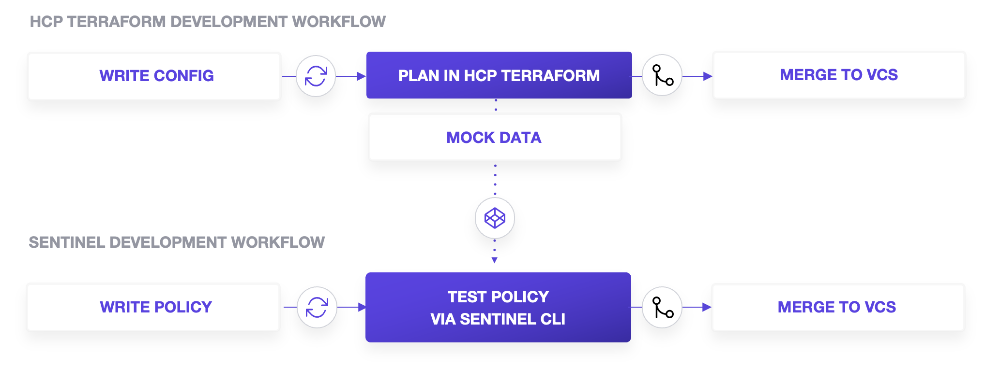
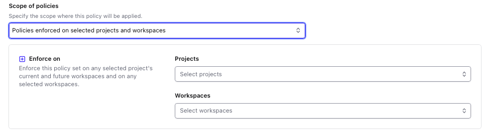

# ポリシーコードの開発

お疲れ様でした、ここまでの章で HCP Terraform を中心に、様々な HashiCorp プロダクトと Sentinel の連携や、実際のポリシーコードの開発方法を学習してきました。\
最終週であるこの章では、これまでの内容を振り返りつつ、大規模なポリシーの開発の中で設計上重要となるポイントについて触れていきます。

## Development digests
ここまでのまとめにもなりますが、Sentinel でのポリシー開発は以下のような大きな流れを踏む形になります。

1. クラウドリソースを作成する Terraform コードを作成
2. Terraform コードが実行される HCP Terraform の Workspace を作成
3. `terraform plan` を実行
4. HCP Terraform UI の plan 結果から mock を生成・ダウンロード
5. Sentinel ポリシーコードを作成
6. ポリシーに対するテストケースを作成し、`sentinel test` コマンドを利用してテストを実施
7. 想定されうるテストケースすべてが PASS することを確認
8. `Policy Sets` を通じて HCP Terraform へポリシーを適用

通常、インフラ構成を定義した Terraform コードが格納されるリポジトリと、Sentinel のポリシーコードが格納されるリポジトリとは、以下のような理由からそれぞれ独立してメンテナンスを行われます。
- インフラ構成のライフサイクルとポリシー定義のライフサイクルとは一般的に異なり、これらが依存し合わないようにするため
- Terraform 開発者と Sentinel 開発者との主管範囲や責務が異なるため



## Directory layouts
ポリシーコードのリポジトリ構成に、フレームワークのような厳密な制約はありませんが、以下のような形が取られることが多いです。

```shell
.
├── functions/                  # ヘルパー関数などを含むライブラリ
├── imports/                    # Sentinel ポリシーがロジック内で評価する際に利用可能なインポートデータ
├── policies/                   # Sentinel ポリシー定義
│   ├── gcp/
│   │   ├── test/
│   │   ├── 001-xxx.sentinel
│   │   │   # ...
│   │   └── 010-xxx.sentinel
│   ├── aws/
│   │   ├── test/
│   │   ├── 001-xxx.sentinel
│   │   │   # ...
│   │   └── 010-xxx.sentinel
│   ├── azure/
│   │   ├── test/
│   │   ├── 001-xxx.sentinel
│   │   │   # ...
│   │   └── 010-xxx.sentinel
│   │   # ...
│   ├── hcl/
│   └── hcp-terraform/
├── policy-sets/                # 適用対象のポリシーセット定義
│   ├── develop/
│   │   └── sentinel.hcl
│   └── global/
│       └── sentinel.hcl
├── README.md                   # Project root
└── .gitignore
```

- **`imports/`**
  - Sentinel ポリシーがインポートして評価することができる static import データを含むトップレベルディレクトリ
- **`functions/`**
  - Sentinel ポリシーファイルにインポートしてポリシー開発を容易にする「ヘルパー」（再利用可能）関数を含むトップレベルディレクトリ
  - module import される対象となる `.sentinel` ファイルが格納されることが多いです
- **`policies/`**
  - クラウドプロバイダごとに整理された Sentinel ポリシーファイルのサブディレクトリを保持するトップレベルディレクトリ
  - 各種ポリシーに対応するテスト設定や mock などもこの中に含まれます
- **`policy-sets/`**
  - 特定のポリシーセットを表すサブディレクトリを含むトップレベルディレクトリ
  - ポリシーセットは要件に合わせて柔軟に構成可能ですが、後述の Policy Graduation のアプローチを取られることが多いです

## Policy Graduations
Policy の開発においても、一般的なアプリケーション開発や Terraform コード開発のように適用範囲を段階的に広げていく開発アプローチを取りたいケースは多いかと思います。
（例：テスト用環境で正常にガードレールとして機能することを確認したのち、本番環境で適用したい、など）

特に、HCP Terraform 上での実行においては、Policy Set の設定として適用先の Project や Workspace を限定することができるため、
テスト用および本番用とで Policy Set を分離することによってこのような要件を実現することができます。



即ち、上記のディレクトリ構成を例とした場合、
1. `policy-sets/develop/sentinel.hcl` はポリシー実装と同時に反映
2. develop policy-set が適用されている Project や Workspace で実際のポリシー評価の確認（Acceptance）
3. develop 環境でのポリシー適用が問題ないと判断したのち、`policy-sets/global/sentinel.hcl` へポリシー設定を反映（Graduation）

という VCS を中心とした開発フローによって、develop 環境のみ -> global(production) 環境というポリシー昇格/本番リリースを行うことが可能となります。

このような段階的なアプローチは、Policy 開発者の意図しない挙動により HCP Terraform 利用者への影響を最小化することができるだけでなく、\
Policy Set の柔軟さによりアプリケーション開発などと同様の開発/リリースフローを維持することができるという側面も持っています。

## Naming conventions
ポリシーの命名規則は簡潔でわかりやすいものを利用することが望ましく、以下が代表的なものとなります。
- `enforce-*`
  - 必要または強制により何かを実行させる。
  - パターンや戦略を強制する
- `require-*`
  - 特定の目的のために必要とする。
  - あるプロパティの設定/未設定を必要とする
- `restrict-*`
  - 制限を設けて、管理下に置く。
  - プロパティの値を設定できる/できないように制限する

これは、**1 Policy は 1 ロジック** を原則としてポリシー自体はシンプルに保ちつつも、多様なポリシーを Policy Set により柔軟に適用させるという Sentinel の設計指針にも関連があります。\
ポリシーの実装において最も重要なことは、ポリシーが読みやすく、理解しやすく、問題が発生してもコンテキスト切り替えが不要であることです。

Sentinel のテストに関連するファイルについては、以下のような規則が利用されることが多いです。
- テストケースファイル（`*.hcl`）は `test-*` というプレフィックス
- mock データファイル（`*.sentinel`）は `mock-*` というプレフィックス

また、最低限、1つのポジティブ（PASS）テストケースと1つのネガティブ（FAIL）テストケースを含めることが望ましいです。

## CI
一般的なアプリケーション開発同様に、ポリシーリポジトリにおいても CI 上での自動化を行うことにより開発効率の向上を図ることも可能です。\
パイプラインジョブの代表的な実装例としては以下のようなものがあります。

フォーマットを行う場合:

```shell
find . -name "*.sentinel" -type f | xargs sentinel fmt
```

CI パイプライン上でリポジトリ内の全てのポリシーをテストする場合
- GitHub Actions を利用する場合には、[`hashicorp/setup-sentinel`](https://github.com/hashicorp/setup-sentinel) が利用可能です

```shell
sentinel test ./policies/*
```

## Editor plugins & SDKs
- [VSCode Plugin](https://marketplace.visualstudio.com/items?itemName=HashiCorp.sentinel)
- [Vim plugin](https://github.com/hashicorp/sentinel.vim)
- [Sentinel SDK](https://github.com/hashicorp/sentinel-sdk)
