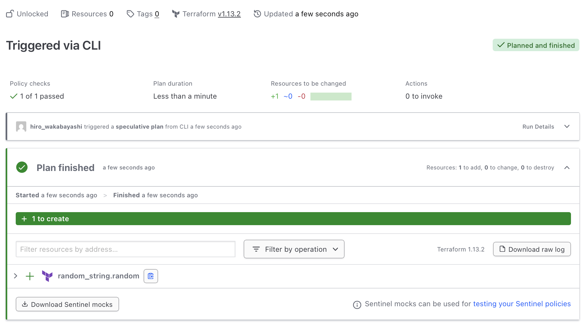

# Terraform 連携

ここまでは Sentinel のポリシーコード開発において重要となる概念や機能などを説明してきましたが、本章では HCP Terraform との連携について学習します。
Sentinel は HashiCorp 製品全般との親和性高く開発されていますが、HCP Terraform との連携は非常に強力でユースケースも多い連携パターンとなります。

定義できるポリシーは多岐に渡りますが、下記のような一例としてユースケースがあります。

* Terrafrom 実行時間の制御
* AZ/Region の制約
* タグの確認
* CIDR やネットワーク設定の確認
* 特定リソースの利用禁止

ここでは、実際に HCP Terraform で Terraform コードを作成し、ポリシーを適用後、Run（`terraform plan`）を実行してみて、Sentinel がどのように連携するかを実際に試してみましょう。

## Implement Terraform code
まず、random provider [(terraform-provider-random)](https://registry.terraform.io/providers/hashicorp/random/latest/docs) を利用してランダムな文字列をリソースとして作成する Terraform コードを作成します。

```shell
% export HCP_ORGANIZATION_NAME='hwakabh-dev'
% export HCP_WORKSPACE_NAME='learn-null-provider'

% cat >> main.tf <<EOF
terraform {
  cloud {
    organization = "${HCP_ORGANIZATION_NAME}"
    workspaces {
      name = "${HCP_WORKSPACE_NAME}"
    }
  }
  required_providers {
    random = {
      source  = "hashicorp/random"
      version = "3.7.2"
    }
  }
}

resource "random_string" "random" {
  length           = 16
  special          = true
}
EOF
```

上記のランダムな文字列を生成するのみのシンプルな Terraform コードを HCP Terraform 上で実行します。 \
以下のコマンドを実行し、HCP Terraform 上で Run が実行されたことを確認してください。

```shell
% terraform login
% terraform init
% terraform plan
```

この Terraform コードを評価するポリシーの実装詳細については後述しますが、ここでは簡便のため policy コードのファイル作成のみを事前に行なっておきます。

```shell
% touch ./restrict-short-random-string.sentinel
```

## Downloading Run mocks
ここまでの章で扱ってきたように、Sentinel のポリシー開発においては、独自の `*.sentinel` 形式での mock を用意することが重要になります。 \
`terraform plan` や `terraform apply` 時に HCP Terraform 内で利用されるデータ構造は複雑であり、一般にこれらに対応する mock データをゼロから用意するのは非常に手間がかかります。

HCP Terraform では、`terraform plan` または `terraform apply` を実行すると、その Run の mock ファイルをダウンロードすることができます。 \
この mock ファイルは、Sentinel ポリシー開発において非常に役立ちます。

正常に plan が実行されると、以下のキャプチャのように、`Download Sentinel mocks` というボタンが Run の詳細画面に表示されます。



クリックをすると、以下のような gzip 圧縮形式のファイルがダウンロードされるため、中身を確認してみましょう。

```shell
% file run-wzb42M5TzkXYnD4X-sentinel-mocks.tar.gz
run-wzb42M5TzkXYnD4X-sentinel-mocks.tar.gz: gzip compressed data, original size modulo 2^32 18432

% tar tvf run-wzb42M5TzkXYnD4X-sentinel-mocks.tar.gz
-rw-------  0 0      0        1015 Dec  1 15:44 mock-tfconfig-v2.sentinel
-rw-------  0 0      0        1116 Dec  1 15:44 mock-tfconfig.sentinel
-rw-------  0 0      0        4083 Dec  1 15:44 mock-tfplan-v2.sentinel
-rw-------  0 0      0        2620 Dec  1 15:44 mock-tfplan.sentinel
-rw-------  0 0      0          60 Dec  1 15:44 mock-tfstate-v2.sentinel
-rw-------  0 0      0         353 Dec  1 15:44 mock-tfstate.sentinel
-rw-------  0 0      0         742 Dec  1 15:44 sentinel.hcl
-rw-------  0 0      0        1080 Dec  1 15:44 mock-tfrun.sentinel
```

上記の出力から分かるように、HCP Terraform からダウンロード可能な Run の mock ファイルは、各 imports 用に一式揃ってまとめられていることがわかります。 \
つまり、これは、random provider を用いて実行した Run（plan）に対して、以下のようなデータを mock として Sentinel に取り込むことができ、データにアクセスできることを意味しています。
- Run に含まれる Terraform コードの内容（`mock-tfconfig*.sentinel`）
- Metadata を含めた Plan の内容（`mock-tfplan*.sentinel`）
- State 内部の情報（`mock-tfstate*.sentinel`）
- Run に関する情報（`mock-tfrun.sentinel`）

上記の Sentinel ファイルは、そのまま Sentinel ポリシーコードのテストへ取り込むすることができ、開発者側でゼロから mock を作成する手間を大幅に短縮することができます。
[Tests 3: mocking modules](../contents/test-mock-modules.md) で試した通り、Sentinel では `*.sentinel` ファイルをモジュールとして import することができるため、Sentinel のテスト mock としてそのまま活用することができます。

ポリシー用のテストディレクトリとテストケースに対する設定ファイルを作成し、テストを行います。

```shell
$ mkdir -p ./test/restrict-short-random-string/

# PASS する際のテスト設定と mock を追加
% cat > ./test/restrict-short-random-string/success.hcl <<EOF
mock "tfconfig/v2" {
    module {
        source = "./mock-tfconfig-v2.sentinel"
    }
}

test {
    rules = {
        main = true
    }
}
EOF
```

そして先ほどダウンロードした mock をテスト設定ファイルで指定したパスへ取り込みます。\
今回は `terraform plan` 時に HCP Terraform 上で実行されている Terraform コードにアクセスするため、`tfconfig/v2` を利用します。
現時点でのディレクトリ構成としては以下のようになっているはずです。

```shell
.
├── README.md
├── .terraform/
├── .terraform.lock.hcl
├── main.tf
├── # ...
├── restrict-short-random-string.sentinel
└── test/
    ├── # ...
    └── restrict-short-random-string/
        ├── mock-tfconfig-v2.sentinel
        └── success.hcl
```

## Implement Policy
次に、上記で実装した Terraform コードに対して、`random_string` リソースにより作成される文字列長が 16文字以上であることを強制するポリシーを実装してみます。\
（`random_string` リソースの `length` の値が 16 以上の場合には PASS, 15 以下の場合には FAIL とするような評価ロジックを持つポリシーを実装）

```shell
% cat >> restrict-short-random-string.sentinel <<EOF
import "tfconfig/v2" as config

violatedRandomStrings = filter config.resources as _, attr {
    attr.config.length.constant_value < 16
}

main = rule {
    length(violatedRandomStrings) == 0
}
EOF
```

実装した Policy（restrict-short-random-string.sentinel）のテストに HCP Terraform からダウンロードした mock（test/restrict-short-random-string/mock-tfconfig-v2.sentinel）を利用しテストします。

```shell
% sentinel test -verbose ./restrict-short-random-string.sentinel
```

現在は PASS のテストケース分のみしか mock のダウンロードおよびテスト設定ファイルを作成していないですが、テストが通ることがわかります。

## Policy Sets
これまでの章では、いずれも開発者のローカル環境で `sentinel.hcl` を作成し、ポリシー評価を行っていました。\
HCP Terraform との連携においては、Sentinel の実行環境が開発者のローカルではなく、HCP Terraform 上で行われる形になります。

これにより、Sentinel と HCP Terraform とがシームレスに連携するだけでなく、以下のようなメリットをもたらします。
- ポリシーリポジトリと VCS 連携することにより、ポリシーコードのバージョン管理が可能に
- Sentinel 設定ファイルと HCP Terraform とを紐づける `Policy Sets` による柔軟なポリシー適用パターンの実現

Policy Set は Sentinel の HCP Terraform 連携において非常に重要な役割を持ちます。\
Policy Set は **ポリシーをグルーピングするための HCP Terraform 上の概念であり、実際のポリシーコードと Project/Workspace との橋渡し**を行う役割があります。

ここまでの章で実装してきたあなたの Sentinel コードやテストコード、設定ファイルを、独立した GitHub リポジトリに push して、HCP Terraform から Policy Set を介して連携してみましょう。


## Policy enforcement on HCP
最後に、HCP Terraform においてポリシー評価される様子を見てみましょう。\


## 参考リンク
- [Generate mock Sentinel data with Terraform](https://developer.hashicorp.com/terraform/cloud-docs/workspaces/policy-enforcement/test-sentinel)
- [Manage policies and policy sets in HCP Terraform](https://developer.hashicorp.com/terraform/cloud-docs/workspaces/policy-enforcement/manage-policy-sets)
- [`random_string` resource](https://registry.terraform.io/providers/hashicorp/random/latest/docs/resources/string)
